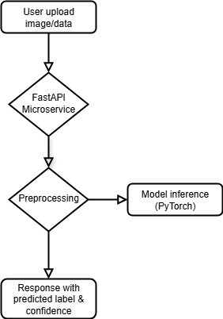
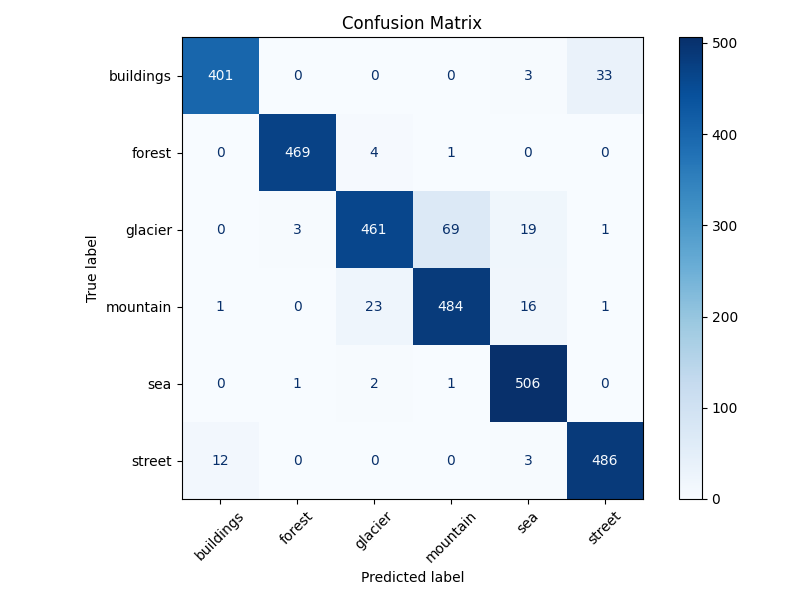
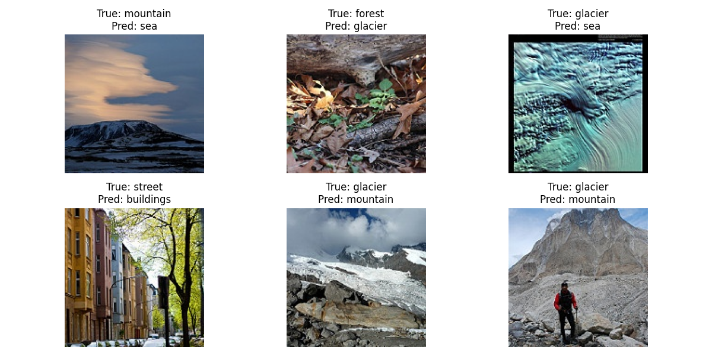

# AutoML Computer Vision API


This program is a lightweight, scalable image classification API powered by PyTorch and FastAPI. It has a fully automated training, hyperparameter tuning and deployment of a computer vision model. The API is production-ready, deployable via Docker and Google Cloud Run.

---

## Table of Contents

- [Introduction](#introduction)
- [Features](#features)
- [Project File Structure](#project-file-structure)
- [Architecture](#architecture)
- [Methods](#methods)
- [Quickstart](#quickstart)
- [Running Locally](#running-locally)
- [Deploying to Google Cloud Run](#deploying-to-google-cloud-run)
- [Prediction Example](#prediction-example)
- [Results](#results)
- [Future Enhancements](#future-enhancements)

---

## Introduction

This project delivers a lightweight, production-ready AutoML application for image classification tasks. It enables users to train, tune and deploy convolutional neural networks (CNNs) with minimal manual intervention. It is built on PyTorch (model training and evaluation), Optuna (hyperparameter tuning), and FastAPI (microservice). The program automates model selection and presents a scalable inference API on Google Cloud Run. Although originally created as a Capstone project, the application is a template for building reproducible and cost effective ML systems.

---

## Features

- AutoML training pipeline with Optuna-based hyperparameter tuning.
- PyTorch's Resnet18 CNN classifier.
- MLflow integration for experiment tracking and model versioning.
- Containerized using Docker.
- FastAPI based microservice.
- Deployment on Google Cloud Run for autoscaling and cost control.
- Inference-ready REST API.

---

## Project File Structure
```
outputs/
    ├── final_model_confusion_matrix.png
    └── final_model_misclassified_images.png
src/
    ├── config.py
    ├── data_loader.py
    ├── eval_utils.py
    ├── train_final.py
    ├── train.py
    └── tune.py
images/
    └── architecture.png
.dockerignore
.gitignore
app.py
Dockerfile
main.py
README.md
requirements.txt
```

---

## Architecture



---

## Methods

The project is highly modular and has the following structure:

1. **Data Preprocessing**: Images are loaded, resized, normalized and augmented for training using torchvision transforms.
2. **Baseline Training**: A pretrained ResNet18 model is fine-tuned on the dataset using supervised learning.
3. **Hyperparameter Tuning**: Optuna tests different learning rates, optimizers, and epochs to find the best configuration.
4. **Final Model Training**: The best hyperparameters are used to retrain the model on the full dataset.
5. **Evaluation & Logging**: MLflow tracks the experiments (different models trained), saves metrics like learning rate, optimizer, epochs, confusion matrix plots and model artifacts.
6. **Model Serving**: The trained model is containerized using Docker and deployed on Google Cloud Run using FastAPI for inference.

## Quickstart

1. **Clone the repo**
```bash
git clone https://github.com/hamodikk/automl-cv-api.git
cd automl-cv-api
```

2. **Build and run locally**
```bash
docker build -t automl-cv-api .
docker run -p 8080:8080 automl-cv-api
```

3. **Access the API**
Visit `http://localhost:8080/docs` to view the Swagger UI.

---

## Running Locally

Make sure Python 3.12 is installed.

```bash
pip install -r requirements.txt
uvicorn app:app --reload
```

---


## Deploying to Google Cloud Run

Ensure that you've:
- Installed and authenticated the Google Cloud CLI (`gloud init`).
- Enable `Cloud Run` and `Artifact Registry` services.
- Created a GCP project.

Then run:

```bash
docker build -t gcr.io/YOUR_PROJECT_ID/automl-cv-api .
docker push gcr.io/YOUR_PROJECT_ID/automl-cv-api
gcloud run deploy automl-cv-api \
    --image gcr.io/YOUR_PROJECT_ID/automl-cv-api \
    --platform managed \
    --region us-central1 \
    --allow-unauthenticated \
    --port 8080 \
    --memory=1Gi
```

---

## Prediction Example

**POST** `/predict`
Upload an image file as form data to receive a JSON response with the predicted label and confidence score.

```bash
curl -X POST http://localhost:8080/predict \
    -F file=@example.jpg
```

**Response**
```json
{
    "label": "mountain",
    "confidence": 0.9627,
    "class_index": 2
}
```

---

## Results

The tuned ResNet18 model achieved the following:

- **Validation Accuracy**: 93.4%
- **Final Test Accuracy**: Consistently above 92% across held-out examples.

Confusion Matrix has been generated for the final model, as well as a sample of misclassified images have been selected to visualize the potential issues.

- 
- 

---

## Discussion & Limitations

### Discussion

The baseline model with default hyperparameters (5 epochs, 0.001 learning rate) had a validation accuracy of ~0.25%. The Optuna hyperparameter tuning alone was able to improve the validation accuracy to ~93%. Upon examining the confusion matrix and the misclassified samples, we can see that some of the inaccuracy is likely caused due to the multi-label nature of the images. For example, an image labeled with "street" could include buildings. However, this could cause the model to correctly learn "building" and correctly classify the "building" in the image but be incorrect since the image only includes "street" label. The dataset's singular label structure likely reduces the accuracy of the model, which in this case would be not representative of the actual accuracy of the model. Including multi-label for this dataset could potentially improve model accuracy further.

### Limitations

Some of the limitations of the current application are:

- **Fixed Model Architecture**: ResNet18 is used for the entire pipeline. Automated model selection would align the application closer to true AutoML from start to finish, as well as make it more accessible.
- **No UI for Training**: Dataset upload, model training, and tuning does not include a user interface, reducing accesibility by non-data science backgrounds.
- **CPU-Based Deployment**: Google Cloud Run deploys to CPU, which could be a limiting factor when it comes to scalability if large batch inference is implemented in the future.

---

## Future Enhancements

- **End-to-end AutoML pipeline**: Allow users to upload labeled datasets to train, tune, and deploy autonomously.
- **Batch prediction UI**: Web form for uploading multiple images at once and downloading predictions as CSV.
- **Simple HTML frontend**: Public-facing landing page with embedded prediction form.
- **CI/CD with GitHub Actions**: Automate Docker build and deploy to Cloud Run on `main` pushes.
- **GCS integration**: Accept image/data uploads directly to Google Cloud Storage.